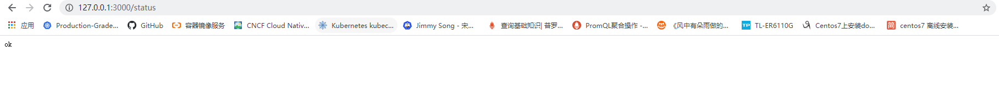
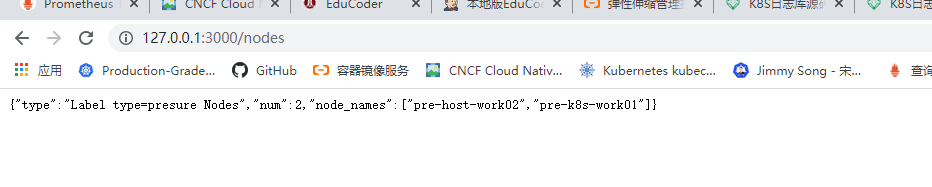

[toc]

# dynamic-Scheduler


### 背景

kubernetes调度策略默认根据node节点的request值（cpu和mem）进行调度，[dynamic-Scheduler](https://github.com/zhangshunping/dynamicScheduler)希望能够解决实际情况过程中遇到如下痛点

- request设置太小，导致node节点上被分配太多的pod，面对流量高峰时，当前节点的资源使用率过高，导致一些pod 出现oom或者无法执行业务的情况。
- request接近于limits,导致node节点上分配的pod数量有限，不能够最大容量的分配pod，而本身设置limits值的原因大多是基于高峰资源，而实际业务大多数情况并未处于高峰状态，所以会造成资源浪费。
- 个性化原因：我们的业务模型创建的pod是自主性pod，虽然社区针对这样的问题有一些好用的开源的平衡组件[descheduler](https://github.com/kubernetes-sigs/descheduler)，但不满足实际的问题，我们需要的时候一个调度的时候就可以根据资源消耗情况选择调度，而descheduler是通过controller的方式对正在集群内的pod进行平衡。

### 解决思路

通过监控获取到各个k8s节点的使用率（cpu，mem等），当超过阈值后，给对应节点打上status=presure，根据k8s软亲和性策略，让pod尽量不调度到打上的presure标签的节点。

- prometheus监控k8s集群的node资源使用率（因为是云原生背景，所以要自动发现弹性节点node，并对弹性节点进行监控）。

  需注意，prometheus.yaml文件中采集node资源时，需要用如下的动态relabel机制，因为，client_golang采集Prometheus的metrics的数据为string，在dynamic-scheduler中使用*ConvertResultDataType*函数将string转换成[]string格式,这里的values为instance的值。

  ```
  
      - job_name: '测试环境k8s资源节点监控'
        kubernetes_sd_configs:
        - role: node
        relabel_configs:
        - source_labels: [__meta_kubernetes_node_address_InternalIP]
          regex: '(.*)'
          replacement: '${1}:9100'
          target_label: __address__
  
  
  ```

  

- 判断prometheus的返回得node使用率的metrics是否超过阈值，从而给k8s node节点打标签status=presure,根据k8s default的调度策略的软亲和preferredDuringSchedulingIgnoredDuringExecution策略，调度的时候尽量不调度到被打上标签status=presure的节点及当前资源紧张的节点。

  ```shell
  template:
      metadata:
        labels:
          run: nginx
      spec:
        affinity:
          nodeAffinity:
            preferredDuringSchedulingIgnoredDuringExecution:
              - preference:
                  matchExpressions:
                    - key: status
                      operator: NotIn
                      values:
                        - presure
                weight: 20
  ```

- 考虑到apiserver的压力问题，使用client—go 原生informer机制，减少对apiserver的压力。

- promethues和dynamic-Scheduler 挂了情况，也不能影响到实际业务，因为使用的软亲和的方式，所以最终一定会有node被调度


### 使用方式

```shell
./dynamic-sheduler --help
   -cpu float
        节点过去一分钟使用率阈值 (-cpu 10) (default 60)
  -kubeconfig string
        链接k8s kubeconfig的绝对路径 (default "C:\\Users\\39295\\go\\src\\config")
  -mem float
        节点内存使用率阈值 (-mem 10) (default 80)
  -prom string
        prometheus链接地址(-prom http://121.40.224.66:49090) (default "http://121.40.224.66:49090")
  -promjob string
        promtheus采集的node节点job名称(-promjob 测试环境k8s资源节点监控) (default "测试环境k8s资源节点监控")
  -s int
        每次抓取prometheus metrics间隔（-s 10) (default 10)
  -webaddr string
        启动服务端口地址(-webaddr :49090) (default ":9000")


```

-  健康检测

```
curl ip:port/status
```



- 查询多少个节点打上了type=presure标签（返回json)

```shell
curl ip:port/nodes
```




